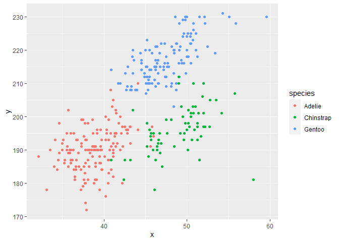

Homework 1
================
Zhixing Wu (zw2709)

This is the solution to Homework 1

``` r
library(tidyverse)
```

    ## -- Attaching packages ---------------------------------------------------------------------------- tidyverse 1.3.0 --

    ## √ ggplot2 3.3.2     √ purrr   0.3.4
    ## √ tibble  3.0.3     √ dplyr   1.0.2
    ## √ tidyr   1.1.2     √ stringr 1.4.0
    ## √ readr   1.3.1     √ forcats 0.5.0

    ## -- Conflicts ------------------------------------------------------------------------------- tidyverse_conflicts() --
    ## x dplyr::filter() masks stats::filter()
    ## x dplyr::lag()    masks stats::lag()

# Problem 1

Create a data frame with specified elements:

``` r
prob1_df =
  tibble(
    samp = rnorm(10),
    samp_gt_0 = samp >0,
    char_vec = c("a", "b", "c", "d", "e", "f", "g", "h", "i", "j"),
    factor_vec = factor(c("low", "low", "low", "med", "med", "med", "high", "high", "high", "high"))
  )
```

Take the mean of each variable in the data frame

``` r
mean(pull(prob1_df, samp))
```

    ## [1] 0.1095262

``` r
mean(pull(prob1_df, samp_gt_0))
```

    ## [1] 0.5

``` r
mean(pull(prob1_df, char_vec))
```

    ## Warning in mean.default(pull(prob1_df, char_vec)): argument is not numeric or
    ## logical: returning NA

    ## [1] NA

``` r
mean(pull(prob1_df, factor_vec))
```

    ## Warning in mean.default(pull(prob1_df, factor_vec)): argument is not numeric or
    ## logical: returning NA

    ## [1] NA

I can take the mean of numbers and logical, but not character or factor.

Then use as.numeric function

``` r
as.numeric(pull(prob1_df, samp))
as.numeric(pull(prob1_df, samp_gt_0))
as.numeric(pull(prob1_df, char_vec))
as.numeric(pull(prob1_df, factor_vec))
```

We can get results for numbers, logical and even factor, but not for
character.

``` r
as.numeric(pull(prob1_df, samp_gt_0)) * pull(prob1_df, samp)
```

    ##  [1] 0.0000000 0.0000000 0.3612941 0.7039867 0.0000000 0.6295349 0.9269515
    ##  [8] 1.5183430 0.0000000 0.0000000

``` r
as.factor(pull(prob1_df, samp_gt_0)) * pull(prob1_df, samp)
```

    ## Warning in Ops.factor(as.factor(pull(prob1_df, samp_gt_0)), pull(prob1_df, : '*'
    ## not meaningful for factors

    ##  [1] NA NA NA NA NA NA NA NA NA NA

``` r
as.numeric(as.factor(pull(prob1_df, samp_gt_0))) * pull(prob1_df, samp)
```

    ##  [1] -0.8913659 -0.1813535  0.7225882  1.4079734 -0.6563602  1.2590698
    ##  [7]  1.8539029  3.0366860 -0.3819433 -0.9338257

# Problem 2

This is infomation about the dataset.

``` r
data("penguins", package = "palmerpenguins")
summary(penguins)
```

    ##       species          island    bill_length_mm  bill_depth_mm  
    ##  Adelie   :152   Biscoe   :168   Min.   :32.10   Min.   :13.10  
    ##  Chinstrap: 68   Dream    :124   1st Qu.:39.23   1st Qu.:15.60  
    ##  Gentoo   :124   Torgersen: 52   Median :44.45   Median :17.30  
    ##                                  Mean   :43.92   Mean   :17.15  
    ##                                  3rd Qu.:48.50   3rd Qu.:18.70  
    ##                                  Max.   :59.60   Max.   :21.50  
    ##                                  NA's   :2       NA's   :2      
    ##  flipper_length_mm  body_mass_g       sex           year     
    ##  Min.   :172.0     Min.   :2700   female:165   Min.   :2007  
    ##  1st Qu.:190.0     1st Qu.:3550   male  :168   1st Qu.:2007  
    ##  Median :197.0     Median :4050   NA's  : 11   Median :2008  
    ##  Mean   :200.9     Mean   :4202                Mean   :2008  
    ##  3rd Qu.:213.0     3rd Qu.:4750                3rd Qu.:2009  
    ##  Max.   :231.0     Max.   :6300                Max.   :2009  
    ##  NA's   :2         NA's   :2

### Variables

The dataset penguins has eight variables, and the variable names are
species, island, bill\_length\_mm, bill\_depth\_mm, flipper\_length\_mm,
body\_mass\_g, sex, year.

There are three factors in total: ‘species’,‘island’, ‘sex’.

  - The variable ‘species’ has three levels: Adelie, Chinstrap, Gentoo.
  - The variable ‘island’ has three levels: Biscoe, Dream, Torgersen.
  - The variable ‘sex’ has three levels: female, male.

The other five variables have numerical values.

  - The variable ‘bill\_length\_mm’ has the range: \[32.1, 59.6\], the
    minimum value: 32.1, the maximum value: 59.6, the mean value:
    43.9219298.

  - The variable ‘bill\_depth\_mm’ has the range: \[13.1, 21.5\], the
    minimum value: 13.1, the maximum value: 21.5, the mean value:
    17.1511696.

  - The variable ‘flipper\_length\_mm’ has the range: \[172, 231\], the
    minimum value: 172, the maximum value: 231, the mean value:
    200.9152047.

  - The variable ‘body\_mass\_g’ has the range: \[2700, 6300\], the
    minimum value: 2700, the maximum value: 6300, the mean value:
    4201.754386.

  - The variable ‘year’ has the range: \[2007, 2009\], the minimum
    value: 2007, the maximum value: 2009.

### Size of the dataset:

The dataset has 344 rows and 8 columns in total. The size of the
‘penguins’ dataset is 344 \* 8.

### Mean flipper length

The mean of flipper\_length\_mm is 200.9152047.

### Scatterplot

Create a data frame containing variables for the plot.

``` r
plot_df = tibble(
    x = pull(penguins, bill_length_mm),
    y = pull(penguins, flipper_length_mm),
    species = pull(penguins, species)
)
```

This is the scatterplot of flipper\_length\_mm (y) vs bill\_length\_mm
(x).

``` r
ggplot(plot_df, aes(x = x, y = y, color = species)) + geom_point()
```

<!-- -->

``` r
ggsave('scatter_plot.pdf', height = 4, width = 4)
```
